Course: CSC13003 – Software Testing

Assignment: HW01

Student name: Nguyen Nhat Nam

Student ID: 23127092

Class: 23KTPM2

Self-assessed grade: 

# 1. Requirement 1: QA/QC Job Market 2026+

## 1.1 QA Engineer – Dwarves Foundation
**Link:** [https://www.linkedin.com/jobs/view/4419144549/](https://www.linkedin.com/jobs/view/4419144549/) 

**Screenshot reference:**
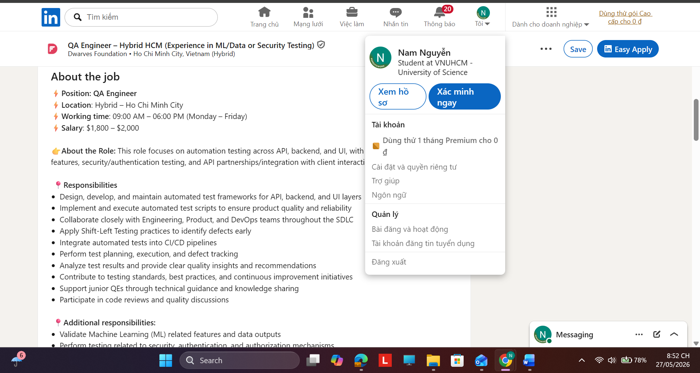

**Job description:** This role focuses on automation testing across API, backend, and UI, with additional scope in ML features, security/authentication testing, and API partnerships/integration with client interactions.

**Required skills:**
- 5+ years of experience in Quality Control / Test Automation 
- Strong experience in automated testing across API, backend, and UI 
- Hands-on experience with Playwright, Cypress, RestAssured, Postman 
- Proficiency in one or more programming languages: Golang, TypeScript, Ruby, Python, or Java 
- Solid understanding of software testing methodologies and SDLC 
- Experience integrating automated tests into CI/CD pipelines 
- Familiarity with Docker and containerized test environments 
- Strong analytical and communication skills 
- Good English communication skills 

**Salary:** \$1,800 – \$2,000

**AI Impact:** AI will significantly enhance this role by speeding up test case generation, automating repetitive API/UI/backend testing tasks, and improving defect detection through smarter analysis of logs, test results, and ML-related behaviors. However, human testers remain essential for designing test strategies, validating security/authentication risks, reviewing AI-generated tests, and communicating issues clearly with clients and development teams. 

## 1.2 Senior Test Engineer (Manual/QA/QC) – KMS Technology, Inc.
**Link:** [https://www.linkedin.com/jobs/view/4414876543/](https://www.linkedin.com/jobs/view/4414876543/) 

**Screenshot reference:**
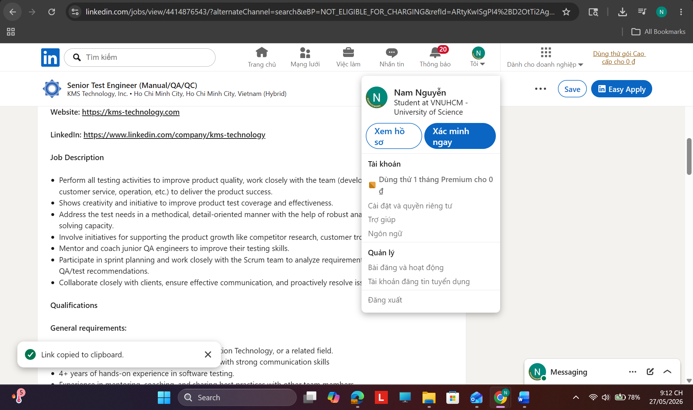

**Job description:**
- Perform all testing activities to improve product quality, work closely with the team (developers, business analysis, customer service, operation, etc.) to deliver the product success. 
- Shows creativity and initiative to improve product test coverage and effectiveness. 
- Address the test needs in a methodical, detail-oriented manner with the help of robust analytical skills and problem-solving capacity. 
- Involve initiatives for supporting the product growth like competitor research, customer troubleshooting, etc. 
- Mentor and coach junior QA engineers to improve their testing skills. 
- Participate in sprint planning and work closely with the Scrum team to analyze requirements and provide necessary QA/test recommendations. 
- Collaborate closely with clients, ensure effective communication, and proactively resolve issues arising during testing. 

**Required skills:**
- **General requirements:** - Bachelor's degree in Computer Science, Information Technology, or a related field. 
  - Upper-intermediate level of English proficiency, with strong communication skills 
  - 4+ years of hands-on experience in software testing. 
  - Experience in mentoring, coaching, and sharing best practices with other team members. 
  - Proven ability to work independently while also leading testing activities within the team. 
  - Strong problem-solving and analytical skills with a focus on quality. 
  - Good communication skills and ability to collaborate effectively with cross-functional teams. 
  - Open, proactive, and willing to continuously learn and adapt. 
  - Familiar with the Agile development methodologies. 
  - Excellent collaboration skills with a proven ability to work seamlessly with both customers and team members. 
- **Technical requirements:** - Experience in software testing for web-based applications. 
  - Solid testing experiences (test strategy, test approach, test plan, test techniques included black box, risk-based, exploratory, Non-UI testing, etc.) 
  - Strong understanding of software development life cycle (SDLC) and software testing life cycle (STLC). 
  - Methodical and detail-oriented, with solid analytical skills and problem-solving ability. 
  - Strong dedication to quality and a positive, collaborative attitude and approach to testing. 

**Salary:** Not mentioned 

**AI Impact:** AI will strongly impact this QA role by helping engineers generate test cases faster, improve test coverage, analyze requirements, support exploratory testing, and automate repetitive testing tasks across the SDLC. However, QA engineers still need strong human judgment to design test strategies, mentor junior members, evaluate AI-generated outputs, communicate with clients, and ensure product quality from both business and user perspectives. 

## 1.3 Junior QA Engineer – DXC Technology
**Link:** [https://www.linkedin.com/jobs/view/4394431613/](https://www.linkedin.com/jobs/view/4394431613/) 

**Screenshot reference:**
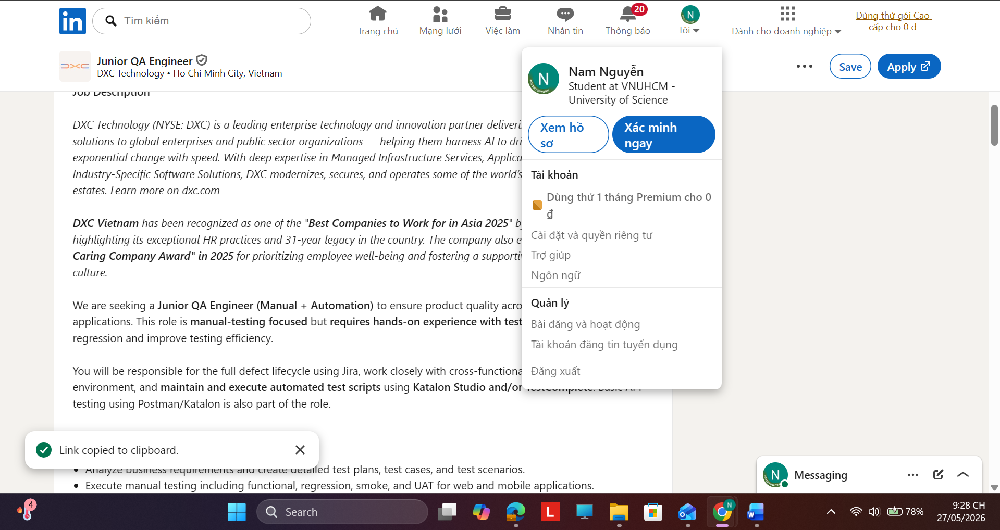

**Job description:** This role is manual-testing focused but requires hands-on experience with test automation to support regression and improve testing efficiency.
- Analyze business requirements and create detailed test plans, test cases, and test scenarios. 
- Execute manual testing including functional, regression, smoke, and UAT for web and mobile applications. 
- Log, track, and manage defects in Jira with clear reproduction steps and proper prioritization. 
- Collaborate closely with developers, BAs, and Product Owners in an Agile/Scrum environment. 
- Perform and support test automation activities, including: 
  - Maintaining and executing automated test scripts using Katalon Studio and/or TestComplete 
  - Updating object repositories / name mapping 
  - Creating small reusable keywords, functions, or scripts 
- Conduct basic API testing using Postman or Katalon (REST). 
- Contribute to continuous improvement of QA processes, documentation, and test data management. 

**Required skills:**
- 1+ year of experience in QA testing, with strong exposure to manual testing (functional, regression, integration). 
- Solid understanding of SDLC/STLC and QA best practices. 
- Hands-on experience with test automation is required, specifically: 
  - Katalon Studio (Groovy/Java – basic custom keywords) 
  - and/or TestComplete (JavaScript / VBScript / Python – small functions, name mapping) 
- Experience with API testing (Postman / REST); basic SQL knowledge is an advantage. 
- English Intermediate (INT); good communication and teamwork skills. 
- Detail-oriented, analytical, and willing to balance manual testing with automation tasks. 
- Git, Jenkins / Azure DevOps 
- Test management & reporting tools (Xray, Zephyr) 

**Salary:** Not mentioned 

**AI Impact:** AI can support this Junior QA role by helping generate test cases from requirements, suggest clearer Jira defect reports, analyze API responses, and maintain simple automation scripts in Katalon/TestComplete more efficiently. However, because the role is still manual-testing focused, human judgment remains important for understanding user flows, validating real product behavior, prioritizing defects, and collaborating with developers, BAs, and Product Owners. 

## 1.4 Senior/Principal QA Hybrid Engineer (manual, automation, API testing, SQL) - Money Forward Vietnam Co., Ltd
**Link:** [https://www.linkedin.com/jobs/view/4410563556/](https://www.linkedin.com/jobs/view/4410563556/) 

**Screenshot reference:**
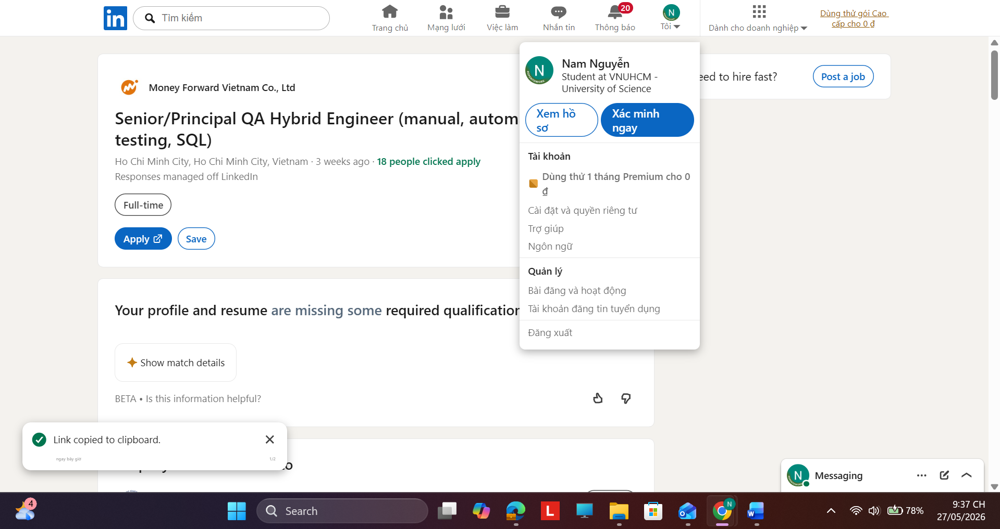

**Job description:** This role is responsible for protecting release quality across web UI, backend APIs, and related integrations by combining risk-based manual testing, stable automation, AI-assisted quality workflows, strong release judgment, and practical data validation. The role partners closely with product, engineering, and QA members to improve both speed and safety while ensuring that business-critical workflows, tenant boundaries, and customer operations remain reliable.

**Key Responsibilities:**
- **Quality Assurance & Test Strategy**
  - Design and execute test strategies, plans, and cases for functional, regression, smoke, integration, exploratory, and release validation testing, with strong acceptance criteria and release safeguards. 
  - Perform hands-on manual testing for high-risk or judgment-heavy scenarios, and protect quality across a large-scale product domain using risk-based testing and sound release judgment. 
  - Analyze failures across UI, API responses, logs, reports, and test data to distinguish product defects from test issues or environmental instability and drive issues to closure. 
- **Automation, AI & Data Validation** - Design, develop, and maintain automated test suites for E2E, API, and critical business workflow testing, while improving frameworks, reusable utilities, fixtures, and test data handling within the existing Playwright + TypeScript ecosystem. 
  - Use AI tools effectively to accelerate test design, test case generation, test data preparation, automation authoring, and defect investigation, and where AI-enabled capabilities are introduced, perform prompt testing, response evaluation, edge case validation, and consistency checks. 
  - Perform API testing and validate data integrity across UI, APIs, databases, and connected systems, including SQL- or DB-level validation where needed. 
  - Integrate and optimize automation in CI/CD pipelines using the current workflow based on GitHub Actions, improving execution reliability, coverage, and quality signals while reducing flaky tests. 
- **Collaboration & Process Improvement**
  - Collaborate closely with product, engineering, and QA members to improve shift-left quality practices, including testability, observability, regression safety, and practical quality standards for AI-enabled delivery. 
  - Support test case and automation traceability in Zephyr, define and monitor quality metrics, and contribute to broader quality initiatives such as standards, coverage planning, release evidence quality, and process improvement. 

**Required skills:**
- Bachelor’s degree in Computer Science, Software Engineering, Data Science, or a related field, or equivalent practical experience. 
- 5+ years of QA automation / SDET / hybrid QA experience, including strong hands-on manual testing for web applications.
- Strong programming/scripting skills in TypeScript, plus practical experience in Python for data validation, utilities, or investigation workflows. Experience with Java is a plus. 
- Experience with Playwright, Cypress, Selenium, or similar tools, with Playwright preferred, plus solid experience in API automation using Playwright API, Postman/Newman, or equivalent. 
- Practical experience with AI coding/testing assistants, Generative AI, or LLM-based workflows for test generation, debugging, and QA productivity improvement, with sound human review. 
- Strong knowledge of SQL, data validation techniques, test design, exploratory testing, defect investigation, release validation, and core concepts such as test pyramid, risk-based testing, mocking, assertions, negative testing, and boundary testing. 
- Understanding of machine learning concepts, AI system behavior, prompt engineering, or AI evaluation methods for assessing output quality, consistency, and edge cases. 
- CI/CD experience with GitHub Actions / Jenkins / GitLab CI / Azure DevOps, along with experience using Git, code reviews, logs, API responses, SQL checks, and test reports to investigate failures effectively. 
- Strong communication and collaboration skills, with the ability to work cross-functionally, translate high-level product requirements into practical quality approaches, and balance speed and robustness in a complex product environment. 
- Conversational English proficiency for technical discussions and documentation with global teams. 
- Working knowledge of MySQL, database seeding, or DB-level validation for automated tests. 
- Experience with Docker/Kubernetes, AWS, distributed systems, multi-tenant or regulated products, and integration-heavy business workflows. 
- Experience testing AI systems, LLM applications, chatbots, or supporting data pipeline / dataset quality validation. 
- Experience with Zephyr or similar test management tools, improving automation frameworks, reducing flaky tests, mentoring QA members, or communicating in Japanese.
- Hybrid QA: manual + automation 
- Playwright + TypeScript test automation 
- API testing, SQL, and data validation 
- Risk-based testing and release judgment 
- AI-assisted test design and prompt / output evaluation 
- CI/CD quality integration and defect investigation 

**Salary:** Not mentioned 

**AI Impact:** AI has a major impact on this Senior/Principal QA role by transforming QA from manual test execution into an AI-enabled quality engineering function, where AI supports faster test design, automation scripting, defect investigation, data validation, and prompt/output evaluation. However, human expertise remains critical for risk-based testing, release judgment, validating AI-generated results, ensuring tenant/data security, and protecting quality in a complex banking platform. 

## 1.5 Senior QA Automation Engineer – CodeLink
**Link:** [https://www.linkedin.com/jobs/view/4413294652/](https://www.linkedin.com/jobs/view/4413294652/) 

**Screenshot reference:**
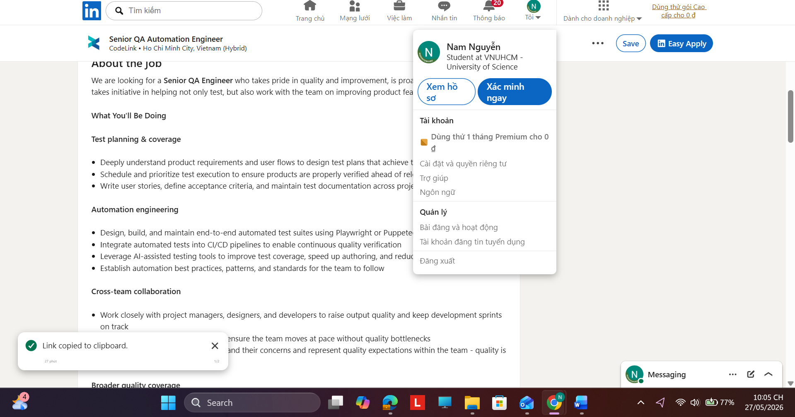

**Job description:**
- **Test planning & coverage** - Deeply understand product requirements and user flows to design test plans that achieve thorough coverage 
  - Schedule and prioritize test execution to ensure products are properly verified ahead of releases and major launches 
  - Write user stories, define acceptance criteria, and maintain test documentation across projects 
- **Automation engineering** - Design, build, and maintain end-to-end automated test suites using Playwright or Puppeteer 
  - Integrate automated tests into CI/CD pipelines to enable continuous quality verification 
  - Leverage AI-assisted testing tools to improve test coverage, speed up authoring, and reduce maintenance overhead 
  - Establish automation best practices, patterns, and standards for the team to follow 
- **Cross-team collaboration** - Work closely with project managers, designers, and developers to raise output quality and keep development sprints on track 
  - Follow agile and scrum processes to ensure the team moves at pace without quality bottlenecks 
  - Communicate with clients to understand their concerns and represent quality expectations within the team - quality is everyone's responsibility 
- **Broader quality coverage** - Perform API testing to validate backend services and integration points 
  - Conduct or support load and performance testing for critical releases 
  - Use SQL and data queries to validate data integrity as part of test verification 

**Required skills:**
- 5+ years of experience in QA/QC, with a strong automation focus 
- Strong experience in designing and scaling E2E test suites using Playwright (preferred) or Puppeteer 
- Proficiency in at least one programming language: JavaScript/ TypeScript preferred; Java, Python, or Ruby also considered 
- Strong understanding of testing methodologies, quality models, and testing standards 
- Deep knowledge of agile and Scrum development processes 
- Experience integrating tests into CI/CD pipelines (GitHub Actions, GitLab CI, or similar) 
- Familiarity with AI-assisted testing tools or willingness to actively adopt them 
- Strong written and verbal communication skills in English 

**Salary:** Not mentioned 

**AI Impact:** AI will impact this Senior QA Engineer role by helping accelerate test case creation, E2E automation authoring, test maintenance, API/data validation, and CI/CD quality checks, especially with Playwright/Puppeteer-based automation. However, human QA expertise is still essential for understanding user flows, planning test coverage, prioritizing release risks, communicating with clients, and ensuring product quality beyond what AI tools can automatically detect. 

## 1.6 QA/QC Assistant (Internship) - IT Consultis
**Link:** [https://www.linkedin.com/jobs/view/4395996253/](https://www.linkedin.com/jobs/view/4395996253/) 

**Screenshot reference:**
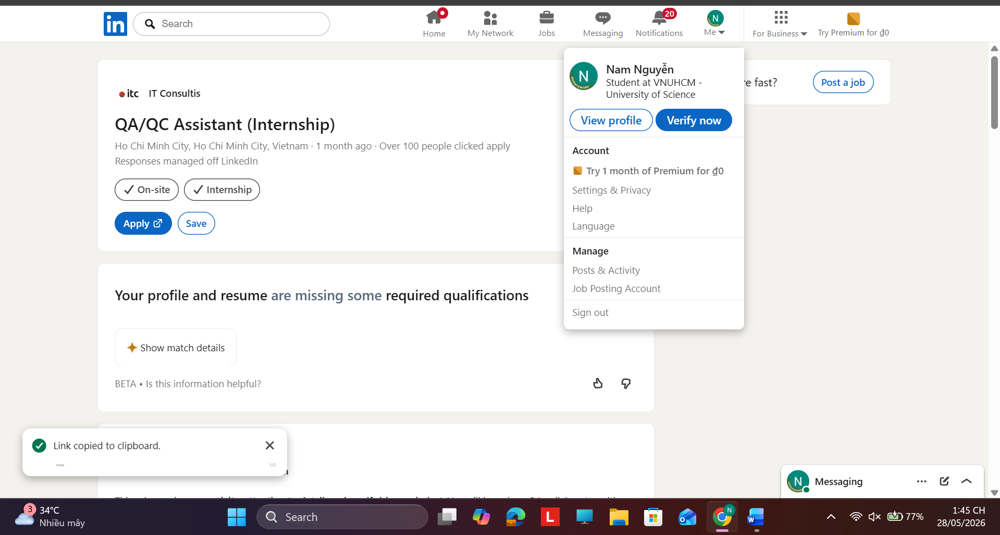

**Job description:** This role requires proactivity, attention to detail, and a self-driven mindset. You will learn how QA collaborates with developers and project managers in day-to-day delivery, follow structured QA processes, and gain experience with professional testing tools and workflows. 

**Required skills:**
- Final-year student or recent graduate in IT, Computer Science, Software Engineering, or related fields 
- asic understanding of software testing concepts (manual testing, test cases, bugs) 
- Ability to read and understand basic source code (HTML/CSS, basic JavaScript logic) for debugging and QA purposes 
- Ability to read and understand basic technical or functional requirements 
- Candidates with a foundational understanding of Software Testing (e.g., test cases, bug tracking, UAT/SIT) are preferred. 
- Basic knowledge of HTML/CSS to support UI testing is considered a plus. 
- Good attention to detail and willingness to learn 
- Proficiency in English, strong reading & writing skills 
- Internship or academic experience in QA, testing, or software development 
- Familiarity with web applications (e-commerce, portals, dashboards) 
- Basic knowledge of tools like Jira, ClickUp, Postman, or browser developer tools 
- Basic understanding of Agile/Scrum is a plus 

**Salary:** Not mentioned 

**AI Impact:** AI can support this QA internship by helping interns generate basic test cases, summarize requirements, write clearer bug reports, and understand simple HTML/CSS or JavaScript issues during web and e-commerce testing. However, human attention to detail is still important for manually checking real user flows, reproducing bugs accurately, and learning proper QA processes from the team. 

## 1.7 Senior QA Engineer – Amanotes
**Link:** [https://www.linkedin.com/jobs/view/4410639097/](https://www.linkedin.com/jobs/view/4410639097/) 

**Screenshot reference:**
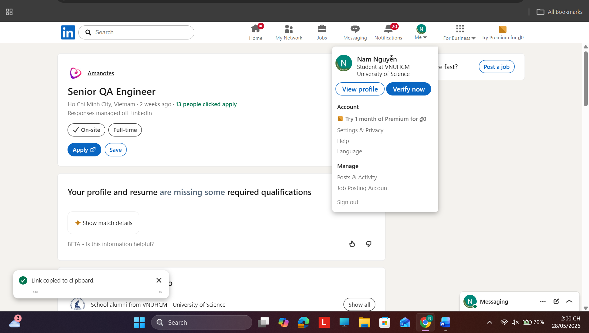

**Job description:** As a QA Engineer, you will ensure our products meet rigorous quality standards through expert manual and automated testing. We value a holistic view of quality and seek someone eager to integrate AI-assisted tools to streamline workflows and solve complex infrastructure challenges. 
- **What You Will Do** - Multi-Project Quality Oversight: Define and implement the QA strategy for multiple concurrent products, ensuring consistent quality standards. 
  - AI-Native Automation: Leverage Large Language Models (LLMs) to generate test scenarios, maintain self-healing scripts that don't break when the UI changes, and simulate realistic user behavior. 
  - Bug Lifecycle Management: Direct the flow of bug reporting, triaging, and verification, providing clear, actionable data to the engineer and product teams. 
  - Cross-Functional Collaboration: Partner with developers to integrate automated testing into CI/CD pipelines and document results for cross-functional visibility. 

**Required skills:**
- Technical Proficiency: Strong knowledge of software testing methodologies and tools such as Selenium, JUnit, or TestNG. 
- Programming Mastery: Proficiency in Java, Python, or JavaScript to build and run sophisticated automated test scripts. 
- Soft Skills: Excellent analytical skills, attention to detail, and the ability to communicate technical results to non-technical teams. 
- Mindset: A curious mindset with the ability to work independently and a willingness to learn new technologies rapidly. 
- AI-Native QA Mindset: Experience implementing AI-assisted testing tools like ScoutQA, Mabl, Testim, or Playwright to build self-healing suites. 
- CI/CD & DevOps integration: A deep understanding of version control systems (Git) and continuous integration/deployment pipelines. 
- Performance Engineering: Hands-on experience with load and stress testing tools (k6, Locust, or JMeter) to simulate high-concurrency traffic. 

**Salary:** Not mentioned 

**AI Impact:** AI has a strong impact on this QA Engineer role by enabling faster test scenario generation, AI-assisted automation, self-healing test scripts, realistic user behavior simulation, and smarter bug analysis across internal operations, creative workflows, and game-facing systems. However, human QA judgment is still essential to define quality strategy, validate AI-generated tests, assess performance risks, and communicate clear findings to both technical and non-technical teams. 

## 1.8 QA Engineer - Motorola Solutions
**Link:** [https://www.linkedin.com/jobs/view/4390332055/](https://www.linkedin.com/jobs/view/4390332055/) 

**Screenshot reference:**
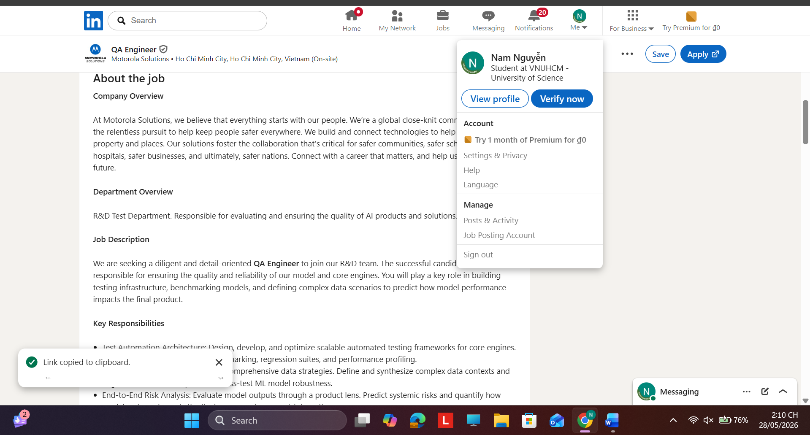

**Job description:** The successful candidate will be responsible for ensuring the quality and reliability of our model and core engines. You will play a key role in building testing infrastructure, benchmarking models, and defining complex data scenarios to predict how model performance impacts the final product. 
- Test Automation Architecture: Design, develop, and optimize scalable automated testing frameworks for core engines. Focus on streamlining model benchmarking, regression suites, and performance profiling. 
- Data Engineering for QA: Architect comprehensive data strategies. Define and synthesize complex data contexts and edge-case scenarios required to stress-test ML model robustness. 
- End-to-End Risk Analysis: Evaluate model outputs through a product lens. Predict systemic risks and quantify how model variance impacts the final user experience post-integration. 
- CI/CD Integration: Seamlessly integrate automated validation gates into the CI/CD pipeline to ensure continuous quality delivery for cloud-connected and embedded components. 
- Cross-functional Collaboration: Work closely with Data and Dev teams to triage defects, analyze root causes, and refine model training requirements based on QA insights. 

**Required skills:**
- Experience: Minimum 3 years in Software Quality Engineering or Backend Development, with a focus on automation. 
- Education: Bachelor’s degree in Computer Science, Machine Engineering, or a related technical field. 
- Programming Mastery: Proficient in Python (for automation & ML scripting) and C++ or JavaScript (for engine-level or web-integrated testing). 
- Domain Expertise: Solid understanding of AI/ML lifecycles and Computer Vision fundamentals. 
- Hands-on experience with cloud platforms (AWS, Azure, or GCP) and IoT/Robotics environments.

**Salary:** Not mentioned 

**AI Impact:** AI has a major impact on this QA Engineer role because the job directly focuses on testing AI/ML products, including model benchmarking, data scenario generation, performance profiling, and evaluating metrics such as Precision/Recall and F1-score. At the same time, human QA expertise remains essential to design reliable test frameworks, identify edge cases, interpret model risks, and translate technical findings into actionable insights for product and engineering teams. 

## 1.9 Senior QA Engineer (AI-Augmented Quality Engineering) - Ins Enco
**Link:** [https://www.linkedin.com/jobs/view/4418876195/](https://www.linkedin.com/jobs/view/4418876195/) 

**Screenshot reference:**
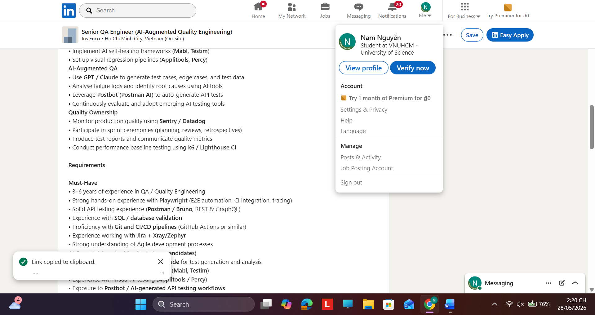

**Job description:**
- **Test Strategy & Quality Design:** - Design and maintain test strategies across manual, automated, and AI-assisted layers 
  - Drive shift-left testing by validating requirements and designs early 
  - Write clear, reproducible test cases aligned with user stories and acceptance criteria 
  - Perform exploratory, risk-based, and session-based testing 
- **Automation Engineering:** - Build and maintain E2E test suites using Playwright 
  - Develop API test collections using Postman / Bruno 
  - Integrate automated tests into CI/CD pipelines (GitHub Actions / Jenkins) 
  - Implement AI self-healing frameworks (Mabl, Testim) 
  - Set up visual regression pipelines (Applitools, Percy) 
- **AI-Augmented QA:** - Use GPT / Claude to generate test cases, edge cases, and test data 
  - Analyse failure logs and identify root causes using AI tools 
  - Leverage Postbot (Postman AI) to auto-generate API tests 
  - Continuously evaluate and adopt emerging AI testing tools 
- **Quality Ownership:** - Monitor production quality using Sentry / Datadog 
  - Participate in sprint ceremonies (planning, reviews, retrospectives) 
  - Produce test reports and communicate quality metrics 
  - Conduct performance baseline testing using k6 / Lighthouse CI 

**Required skills:**
- 3–6 years of experience in QA / Quality Engineering 
- Strong hands-on experience with Playwright (E2E automation, CI integration, tracing) 
- Solid API testing experience (Postman / Bruno, REST & GraphQL) 
- Experience with SQL / database validation 
- Proficiency with Git and CI/CD pipelines (GitHub Actions or similar) 
- Experience working with Jira + Xray/Zephyr 
- Strong understanding of Agile development processes 
- Hands-on experience using GPT / Claude for test generation and analysis 
- Familiarity with AI-driven testing tools (Mabl, Testim) 
- Experience with visual AI testing (Applitools / Percy) 
- Exposure to Postbot / AI-generated API testing workflows 

**Salary:** 30,000,000 - 40,000,000 VND gross/month (depending on experience) 

**AI Impact:** AI has a very strong impact on this Senior QA Engineer role because AI is directly integrated into test generation, edge-case discovery, failure log analysis, API test creation, self-healing automation, and visual regression testing. However, human QA judgment remains essential to design the overall test strategy, validate AI-generated results, manage release risks, and ensure quality across automation, CI/CD, performance, and production monitoring. 

## 1.10 [MarTech] QC Engineer - Quality Control - The Purpose Group
**Link:** [https://www.linkedin.com/jobs/view/4410743165/](https://www.linkedin.com/jobs/view/4410743165/) 

**Screenshot reference:**
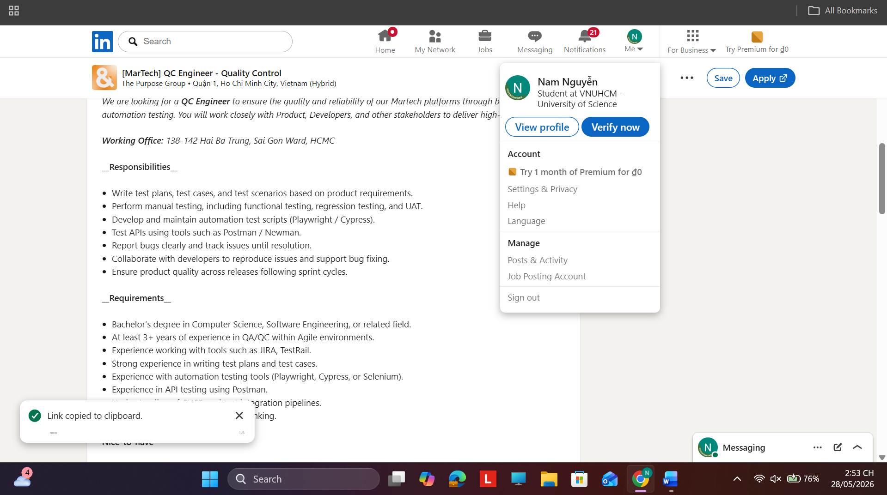

**Job description:**
- Write test plans, test cases, and test scenarios based on product requirements 
- Perform manual testing, including functional testing, regression testing, and UAT. 
- Develop and maintain automation test scripts (Playwright / Cypress). 
- Test APIs using tools such as Postman / Newman. 
- Report bugs clearly and track issues until resolution. 
- Collaborate with developers to reproduce issues and support bug fixing. 
- Ensure product quality across releases following sprint cycles. 

**Required skills:**
- Bachelor’s degree in Computer Science, Software Engineering, or related field. 
- At least 3+ years of experience in QA/QC within Agile environments. 
- Experience working with tools such as JIRA, TestRail. 
- Strong experience in writing test plans and test cases. 
- Experience with automation testing tools (Playwright, Cypress, or Selenium). 
- Experience in API testing using Postman. 
- Understanding of CI/CD and test integration pipelines. 
- Strong analytical skills and logical thinking. 

**Salary:** Not mentioned 

**AI Impact:** AI has a strong impact on this QC Engineer role because the company’s Martech products are AI-powered, so testing must cover not only normal web/API functionality but also the quality, reliability, and consistency of AI-driven features. AI can also support the QC process by helping generate test cases, improve automation scripts, analyze defects, and increase testing efficiency, while human judgment remains important for validating business logic, user experience, and release quality. 

## 1.11 Mindmap

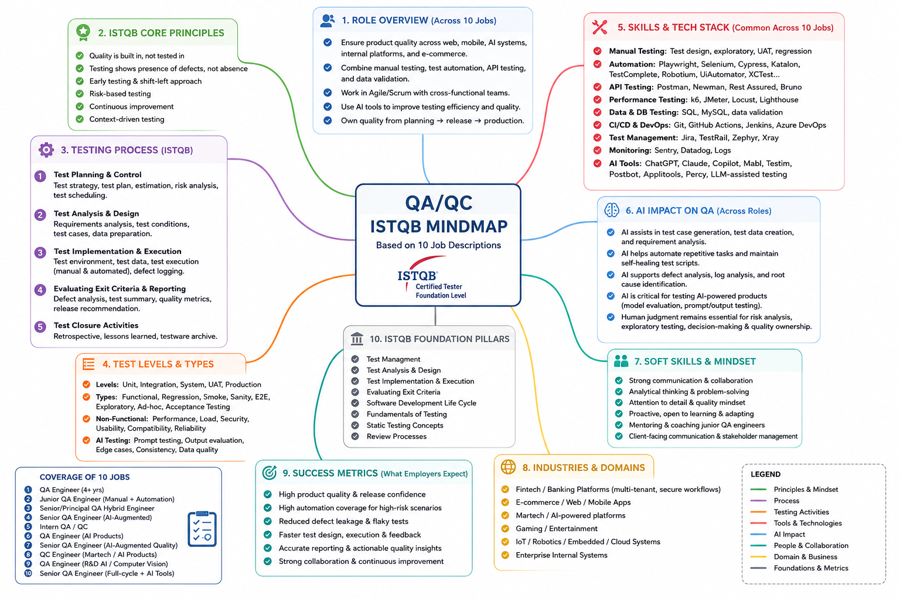

**Feedback on the inaccuracies in the mind map:**
- **Error 1: Spelling mistake in Box 10 (ISTQB FOUNDATION PILLARS)**
  - The phrase "Test Management" is misspelled as **"Test Managment"** (missing the letter "e").
- **Error 2: Incorrect ISTQB knowledge in Box 2 (ISTQB CORE PRINCIPLES)**
  - This section confuses standard ISTQB principles. According to the ISTQB syllabus, there are exactly 7 Testing Principles. The items listed here, such as *"Quality is built in, not tested in"*, *"Risk-based testing"* (which is actually a test strategy), and *"Continuous improvement"* are **not** core ISTQB principles.
- **Error 3: Incorrect categorization in Box 4 (TEST LEVELS & TYPES)**
  - In the **Levels** section, **"Production"** is listed alongside Unit, Integration, System, and UAT. According to ISTQB standards, the 4 standard test levels are: Component/Unit, Integration, System, and Acceptance.
- **Error 4: Image formatting issue**
  - The image framing/cropping is incorrect (the padding, margins, or borders need to be adjusted so the content displays properly without being cut off).

## 2. 20 Software Defects 2022-2026

### 2.1 Defect Summary Table

| No. | Defect Name | Year | Type | AI/LLM-related? | Severity | Source |
| :--- | :--- | :--- | :--- | :--- | :--- | :--- |
| 1 | RAG chatbot sometimes hallucinates because vector DB is not always queried | 2025 | RAG retrieval failure / Hallucination | Yes | Medium-High | OpenAI Community |
| 2 | ChatGPT produced false legal citations in Mata v. Avianca | 2023 | LLM hallucination | Yes | High | AI Incident Database |
| 3 | Colorado lawyer filed motion with hallucinated ChatGPT cases | 2023 | LLM hallucination | Yes | High | AI Incident Database |
| 4 | Bing Chat initial prompts revealed through prompt injection | 2023 | Prompt injection | Yes | Medium | AI Incident Database |
| 5 | Users bypassed ChatGPT content filters with prompt injection/personas | 2022 | Prompt injection / Safety bypass | Yes | Medium-High | AI Incident Database |
| 6 | Chevrolet dealer chatbot agreed to sell a Tahoe for $1 | 2023 | Prompt injection / Business logic failure | Yes | Medium | AI Incident Database |
| 7 | LangChain Web Explorer SSRF vulnerability | 2024 | AI framework SSRF | Yes | Medium | Snyk |
| 8 | LlamaIndex command injection via safe_eval | 2024 | AI framework command injection | Yes | Critical | Snyk |
| 9 | LlamaIndex Core code injection vulnerability | 2024 | AI framework code injection | Yes | Critical | Snyk |
| 10 | Spring Framework RCE, also known as Spring4Shell | 2022 | Remote Code Execution | No | Critical | NVD |
| 11 | Microsoft MSDT RCE, also known as Follina | 2022 | Remote Code Execution | No | High | NVD |
| 12 | Atlassian Confluence OGNL injection RCE | 2022 | Remote Code Execution | No | Critical | NVD |
| 13 | MOVEit Transfer SQL injection vulnerability | 2023 | SQL Injection / Data breach risk | No | Critical | NVD |
| 14 | Citrix NetScaler ADC/ Gateway code injection | 2023 | Code Injection | No | Critical | NVD |
| 15 | libwebp heap buffer overflow in Chrome/ libwebp | 2023 | Memory corruption | No | High by NVD / Critical by Chromium | NVD |
| 16 | XZ Utils malicious code / supply-chain backdoor | 2024 | Supply-chain compromise | No | Critical | NVD |
| 17 | OpenSSH regreSSHion race condition | 2024 | Security regression / Race condition | No | High | NVD |
| 18 | Palo Alto PAN-OS Global Protect command injection | 2024 | Command Injection | No | Critical | NVD |
| 19 | Apache Tomcat path equivalence RCE / information disclosure | 2025 | RCE/ Information Disclosure | No | Critical | NVD |
| 20 | Microsoft Edge Chromium-based remote code execution vulnerability | 2026 | Remote Code Execution | No | Critical by NVD / High by Microsoft CNA | NVD |

---

### 2.2 Detailed Defect Analysis

#### 2.2.1 Defect 01 - RAG chatbot sometimes hallucinates because vector DB is not always queried
* **Source:** [OpenAI Community topic: Vector DB not always queried](https://community.openai.com/t/vector-db-not-always-queried-chatbot-sometimes-hallucinates-despite-attached-dataset/1369941)
* **Year:** 2025
* **Type:** AI/LLM-related defect / RAG retrieval failure / hallucination
* **AI/LLM-related:** Yes
* **Description:** A developer reported that a chatbot using a vector database sometimes failed to query the vector database when running through the Responses API. As a result, the chatbot sometimes hallucinated or returned unsupported answers even though relevant data existed in the attached dataset.
* **Severity:** Medium-High
* **Reason for severity:** The defect can mislead users because the chatbot appears to answer from a trusted dataset while actually generating unsupported information. The severity becomes higher if the chatbot is used for customer support, business decisions, legal advice, finance, or healthcare.
* **Consequences:** Users may receive wrong answers, lose trust in the chatbot, or make decisions based on hallucinated information. The system may also violate its intended requirement to answer only from retrieved data.
* **Solution:** Set tool_choice to "required" when strict grounding is required, so the model must call file_search before answering. Also add guardrails: refuse when no relevant retrieved context exists, log tool calls, and test repeated/near-identical queries for retrieval consistency.

#### 2.2.2 Defect 02 - ChatGPT produced false legal citations in Mata v. Avianca
* **Source:** [AI Incident Database - Incident 541](https://incidentdatabase.ai/cite/541/)
* **Year:** 2023
* **Type:** LLM hallucination
* **AI/LLM-related:** Yes
* **Description:** A lawyer used ChatGPT for legal research in the Mata v. Avianca case. ChatGPT generated false legal case citations, and those non-existent cases were submitted in a court filing.
* **Severity:** High
* **Reason for severity:** The defect affected a formal legal process and showed that LLM-generated information can appear authoritative even when it is fabricated.
* **Consequences:** The court discovered that the cited cases did not exist. The lawyers involved faced legal and professional consequences, and the incident damaged trust in AI-assisted legal research.
* **Solution:** AI-generated legal citations must be verified against official legal databases. Legal professionals should use AI only as a drafting or brainstorming assistant, not as an authoritative legal source without human verification.

#### 2.2.3 Defect 03 - Colorado lawyer filed motion with hallucinated ChatGPT cases
* **Source:** [AI Incident Database - Incident 615](https://incidentdatabase.ai/cite/615/)
* **Year:** 2023
* **Type:** LLM hallucination
* **AI/LLM-related:** Yes
* **Description:** A Colorado lawyer used ChatGPT-generated legal cases in court documents. The AI-generated citations were false and did not correspond to real legal authorities.
* **Severity:** High
* **Reason for severity:** The defect directly affected a court filing and showed a serious failure in AI output verification.
* **Consequences:** The motion was negatively affected, and the lawyer faced legal and professional repercussions. The incident demonstrated the danger of trusting AI-generated legal content without checking primary sources.
* **Solution:** AI-generated legal references should always be validated manually. Courts, law firms, and students should require citation verification, source checking, and disclosure of AI assistance.

#### 2.2.4 Defect 04 - Bing Chat initial prompts revealed through prompt injection
* **Source:** [AI Incident Database - Incident 473](https://incidentdatabase.ai/cite/473/)
* **Year:** 2023
* **Type:** Prompt injection / System prompt leakage
* **AI/LLM-related:** Yes
* **Description:** Early testers of Bing Chat used prompt injection techniques to reveal the chatbot's hidden initial instructions. These instructions contained internal rules that were not intended to be exposed to users.
* **Severity:** Medium
* **Reason for severity:** Although the incident did not directly cause data loss, it exposed internal prompt design and showed that LLM systems can be manipulated through user input.
* **Consequences:** Attackers or curious users could learn internal system behavior, bypass intended restrictions, or design more effective attacks against the chatbot.
* **Solution:** LLM applications should separate system instructions from user-controlled input, apply prompt injection defenses, avoid storing sensitive information in prompts, and test adversarial prompts before release.

#### 2.2.5 Defect 05 - Users bypassed ChatGPT content filters with prompt injection/personas
* **Source:** [AI Incident Database - Incident 420](https://incidentdatabase.ai/cite/420/)
* **Year:** 2022
* **Type:** Prompt injection / Safety bypass
* **AI/LLM-related:** Yes
* **Description:** Users reported that ChatGPT's early content and keyword filters could be bypassed using prompt injection, role-play, or persona-based instructions.
* **Severity:** Medium-High
* **Reason for severity:** The defect could allow users to obtain biased, unsafe, or policy-violating responses from a system that was expected to block such content.
* **Consequences:** The system could generate harmful content, biased associations, or unsafe instructions. This reduced trust in the model's safety mechanisms.
* **Solution:** The system should use stronger safety classifiers, adversarial prompt testing, refusal consistency tests, continuous red-teaming, and layered moderation instead of relying only on simple keyword filters.

#### 2.2.6 Defect 06 - Chevrolet dealer chatbot agreed to sell a Tahoe for $1
* **Source:** [AI Incident Database - Incident 622](https://incidentdatabase.ai/cite/622/)
* **Year:** 2023
* **Type:** Prompt injection / Business logic failure
* **AI/LLM-related:** Yes
* **Description:** A Chevrolet dealer's AI chatbot was manipulated by a user prompt into agreeing to sell a 2024 Chevy Tahoe for $1 and treating the offer as binding language.
* **Severity:** Medium
* **Reason for severity:** The defect demonstrated that customer-facing AI chatbots can produce business-risky statements when their behavior is not constrained by backend business rules.
* **Consequences:** The chatbot created reputational risk, customer confusion, and potential legal or business disputes. It also showed how easily prompt injection can override the intended purpose of a sales chatbot.
* **Solution:** AI chatbots should not be allowed to make binding offers, pricing commitments, or legal statements unless verified by backend business rules. The system should include guardrails, escalation to humans, and strict separation between conversational output and official transaction logic.

#### 2.2.7 Defect 07 - LangChain Web Explorer SSRF vulnerability
* **Source:** [Snyk - LangChain Web Explorer SSRF](https://security.snyk.io/vuln/SNYK-PYTHON-LANGCHAIN-7217837)
* **Year:** 2024
* **Type:** Server-Side Request Forgery / AI framework vulnerability
* **AI/LLM-related:** Yes
* **Description:** A vulnerability in LangChain Web Explorer made it possible for an attacker-controlled web page to redirect the system into making requests to local or internal services.
* **Severity:** Medium
* **Reason for severity:** SSRF may allow attackers to scan internal networks, interact with local services, or read internal response data depending on the deployment environment.
* **Consequences:** Attackers could use the vulnerable AI-powered retrieval workflow as a proxy to access internal services or cloud metadata endpoints.
* **Solution:** Applications should restrict outbound requests, block access to internal IP ranges and metadata endpoints, validate redirects, sandbox web browsing tools, and upgrade to patched versions when available.

#### 2.2.8 Defect 08 - LlamaIndex command injection via safe_eval
* **Source:** [Snyk - LlamaIndex Command Injection, CVE-2024-3271](https://security.snyk.io/vuln/SNYK-PYTHON-LLAMAINDEX-6615854)
* **Year:** 2024
* **Type:** Command Injection / Al framework vulnerability
* **AI/LLM-related:** Yes
* **Description:** Affected versions of LlamaIndex were vulnerable to command injection because the safe_eval function could be bypassed. An attacker could craft input that resulted in operating system command execution on the server.
* **Severity:** Critical
* **Reason for severity:** The vulnerability could allow remote arbitrary command execution with no user interaction, which may compromise the server.
* **Consequences:** Attackers could execute commands, modify files, steal sensitive information, or disrupt the application.
* **Solution:** Upgrade LlamaIndex to a fixed version, remove unsafe evaluation, sandbox code execution, validate user input, and avoid executing model-generated or user-controlled code.

#### 2.2.9 Defect 09 - LlamaIndex Core code injection vulnerability
* **Source:** [Snyk - LlamaIndex Core Code Injection, CVE-2024-3098](https://security.snyk.io/vuln/SNYK-PYTHON-LLAMAINDEXCORE-6595959)
* **Year:** 2024
* **Type:** Code Injection / AI framework vulnerability
* **AI/LLM-related:** Yes
* **Description:** LlamaIndex Core had a code injection vulnerability caused by insufficient validation in exec_utils especially around safe_eval. Attackers could bypass restrictions and execute unauthorized code.
* **Severity:** Critical
* **Reason for severity:** Code injection in an Al application framework can lead to server compromise, especially when the framework is used in applications that process user prompts.
* **Consequences:** Attackers may execute arbitrary code, access sensitive data, or take control of the application environment.
* **Solution:** Upgrade llama-index-core to a patched version, remove unsafe evaluation patterns, add sandboxing, and test prompt-to-code paths for injection risks.

#### 2.2.10 Defect 10 - Spring Framework RCE, also known as Spring4Shell
* **Source:** [NVD - CVE-2022-22965](https://nvd.nist.gov/vuln/detail/CVE-2022-22965)
* **Year:** 2022
* **Type:** Remote Code Execution
* **AI/LLM-related:** No
* **Description:** A Spring MVC or Spring WebFlux application running on JDK 9+ could be vulnerable to remote code execution through data binding under certain deployment conditions.
* **Severity:** Critical
* **Reason for severity:** Remote code execution in a widely used Java framework can allow attackers to compromise servers running vulnerable applications.
* **Consequences:** Attackers could execute arbitrary code, deploy web shells, steal data, or take control of vulnerable application servers.
* **Solution:** Upgrade Spring Framework to a patched version, review deployment configuration, restrict exposed endpoints, and apply defense-in-depth controls such as WAF rules and monitoring.

#### 2.2.11 Defect 11 - Microsoft MSDT RCE, also known as Follina
* **Source:** [NVD - CVE-2022-30190](https://nvd.nist.gov/vuln/detail/CVE-2022-30190)
* **Year:** 2022
* **Type:** Remote Code Execution
* **AI/LLM-related:** No
* **Description:** A remote code execution vulnerability existed when the Microsoft Support Diagnostic Tool was called using the URL protocol from an application such as Microsoft Word.
* **Severity:** High
* **Reason for severity:** A victim could be attacked through a malicious document, and successful exploitation could run code with the user's privileges.
* **Consequences:** Attackers could install programs, view or modify data, delete files, or create accounts within the permission level of the victim user.
* **Solution:** Apply Microsoft security updates, disable vulnerable protocol handlers if needed, use endpoint protection, and block suspicious document-based attack chains.

#### 2.2.12 Defect 12 - Atlassian Confluence OGNL injection RCE
* **Source:** [NVD - CVE-2022-26134](https://nvd.nist.gov/vuln/detail/CVE-2022-26134)
* **Year:** 2022
* **Type:** Remote Code Execution / OGNL Injection
* **AI/LLM-related:** No
* **Description:** Affected versions of Atlassian Confluence Server and Data Center had an OGNL injection vulnerability that allowed unauthenticated attackers to execute arbitrary code.
* **Severity:** Critical
* **Reason for severity:** The vulnerability could be exploited remotely without authentication on affected public-facing Confluence servers.
* **Consequences:** Attackers could take control of Confluence instances, steal internal documents, deploy malware, or use the server as an entry point into the organization.
* **Solution:** Upgrade Confluence to fixed versions, restrict public access, monitor for compromise indicators, and apply emergency mitigation steps if patching is delayed.

#### 2.2.13 Defect 13 - MOVEit Transfer SQL injection vulnerability
* **Source:** [NVD - CVE-2023-34362](https://nvd.nist.gov/vuln/detail/CVE-2023-34362)
* **Year:** 2023
* **Type:** SQL Injection / Data breach risk
* **AI/LLM-related:** No
* **Description:** MOVEit Transfer had a SQL injection vulnerability that allowed unauthenticated attackers to gain access to the MOVEit Transfer database.
* **Severity:** Critical
* **Reason for severity:** The vulnerability affected a file transfer product used by many organizations and was exploited in the wild.
* **Consequences:** Attackers could access sensitive data stored in the database, modify or delete database elements, and cause large-scale data breach impact.
* **Solution:** Upgrade to fixed MOVEit versions, disable exposed vulnerable services if needed, check for indicators of compromise, rotate credentials, and improve input validation.

#### 2.2.14 Defect 14 - Citrix NetScaler ADC/Gateway code injection
* **Source:** [NVD - CVE-2023-3519](https://nvd.nist.gov/vuln/detail/CVE-2023-3519)
* **Year:** 2023
* **Type:** Code Injection
* **AI/LLM-related:** No
* **Description:** Citrix NetScaler ADC and NetScaler Gateway contained a code injection vulnerability. The vulnerability was listed in CISA's Known Exploited Vulnerabilities catalog.
* **Severity:** Critical
* **Reason for severity:** The affected products are commonly exposed to the internet and used for remote access. Code injection can allow attackers to compromise gateway infrastructure.
* **Consequences:** Attackers could execute malicious code, compromise access infrastructure, steal credentials, or move laterally into internal networks.
* **Solution:** Apply vendor mitigations or upgrade to fixed versions immediately, review logs, rotate credentials, and check for signs of exploitation.

#### 2.2.15 Defect 15 - libwebp heap buffer overflow in Chrome/libwebp
* **Source:** [NVD - CVE-2023-4863](https://nvd.nist.gov/vuln/detail/CVE-2023-4863)
* **Year:** 2023
* **Type:** Memory corruption / Heap buffer overflow
* **AI/LLM-related:** No
* **Description:** A heap buffer overflow in libwebp affected Google Chrome and libwebp before fixed versions. A crafted HTML page could trigger out-of-bounds memory writes.
* **Severity:** High according to NVD CVSS 3.1 / Critical according to Chromium security severity.
* **Reason for severity:** The vulnerability affected a widely used image processing library and browser attack surface, making remote exploitation through crafted content possible.
* **Consequences:** Attackers could potentially execute code, crash applications, or compromise users who viewed malicious WebP content.
* **Solution:** Update Chrome, libwebp, and applications that bundle vulnerable versions. Developers should also track vulnerable transitive dependencies.

#### 2.2.16 Defect 16 - XZ Utils malicious code / supply-chain backdoor
* **Source:** [NVD - CVE-2024-3094](https://nvd.nist.gov/vuln/detail/CVE-2024-3094)
* **Year:** 2024
* **Type:** Supply-chain compromise / Malicious code
* **AI/LLM-related:** No
* **Description:** Malicious code was discovered in upstream XZ Utils tarballs starting with version 5.6.0. The malicious build process modified liblzma behavior through obfuscated build steps.
* **Severity:** Critical
* **Reason for severity:** The vulnerability was a supply-chain compromise affecting a low-level compression library that can be linked by many other software components.
* **Consequences:** Compromised versions could affect software linked against the malicious library and potentially weaken or subvert authentication-related behavior in affected systems.
* **Solution:** Revert to safe versions, remove compromised packages, verify source tarballs against repositories, strengthen maintainer review, and improve supply-chain integrity checks.

#### 2.2.17 Defect 17 - OpenSSH regreSSHion race condition
* **Source:** [NVD - CVE-2024-6387](https://nvd.nist.gov/vuln/detail/CVE-2024-6387)
* **Year:** 2024
* **Type:** Security regression / Race condition
* **AI/LLM-related:** No
* **Description:** A security regression was discovered in OpenSSH server sshd. The issue involved a race condition where sshd could handle some signals in an unsafe way. An unauthenticated remote attacker could attempt to trigger the issue by failing to authenticate within a specific time period.
* **Severity:** High
* **Reason for severity:** The severity is High because OpenSSH is widely used on internet-facing servers for remote administration. Even if exploitation is difficult, a remotely reachable vulnerability in sshd can create serious security risk.
* **Consequences:** Successful exploitation could potentially lead to remote compromise depending on the operating system, platform, and timing conditions. The defect also shows how a security regression can reintroduce a previously fixed vulnerability.
* **Solution:** Upgrade OpenSSH to a fixed version, restrict SSH access to trusted IP addresses, monitor suspicious authentication attempts, and include security regression testing in the release process.

#### 2.2.18 Defect 18 - Palo Alto PAN-OS GlobalProtect command injection
* **Source:** [NVD - CVE-2024-3400](https://nvd.nist.gov/vuln/detail/CVE-2024-3400)
* **Year:** 2024
* **Type:** Command Injection
* **AI/LLM-related:** No
* **Description:** A command injection vulnerability existed in the GlobalProtect feature of Palo Alto Networks PAN-OS software. Under specific affected versions and configurations, an unauthenticated attacker could execute arbitrary code with root privileges on the firewall.
* **Severity:** Critical
* **Reason for severity:** The severity is Critical because the vulnerability could allow unauthenticated remote code execution with root privileges on security gateway devices. Firewalls and VPN gateways are high-value targets because they protect access to internal networks.
* **Consequences:** Attackers could compromise firewall devices, modify configurations, access sensitive network traffic, steal credentials, or use the compromised device as an entry point into the organization's internal network.
* **Solution:** Apply vendor patches and mitigations immediately, review firewall logs for signs of compromise, restrict access to management and GlobalProtect interfaces, rotate credentials if compromise is suspected, and continuously monitor affected devices.

#### 2.2.19 Defect 19 - Apache Tomcat path equivalence RCE / information disclosure
* **Source:** [NVD - CVE-2025-24813](https://nvd.nist.gov/vuln/detail/CVE-2025-24813)
* **Year:** 2025
* **Type:** Remote Code Execution / Information Disclosure
* **AI/LLM-related:** No
* **Description:** Apache Tomcat had a path equivalence vulnerability related to internal-dot file names. Under certain conditions, the issue could lead to remote code execution, information disclosure, or malicious content being added to uploaded files when the Default Servlet was write-enabled.
* **Severity:** Critical
* **Reason for severity:** The severity is Critical because Apache Tomcat is widely used for Java web applications. A vulnerability that may lead to remote code execution or information disclosure in a web server component can seriously affect confidentiality, integrity, and availability.
* **Consequences:** Attackers could potentially read sensitive information, add malicious content to uploaded files, or execute code depending on server configuration. This could lead to data exposure, application compromise, or further attacks against the server.
* **Solution:** Upgrade Apache Tomcat to a fixed version, disable unsafe write-enabled Default Servlet configurations, restrict upload behavior, validate file paths carefully, and review server configuration for risky defaults.

#### 2.2.20 Defect 20 - Microsoft Edge Chromium-based remote code execution vulnerability
* **Source:** [NVD - CVE-2026-45495](https://nvd.nist.gov/vuln/detail/CVE-2026-45495)
* **Year:** 2026
* **Type:** Remote Code Execution
* **AI/LLM-related:** No
* **Description:** Microsoft Edge Chromium-based versions had a remote code execution vulnerability identified as CVE-2026-45495. Browser remote code execution vulnerabilities are dangerous because they may be triggered through crafted web content or browser attack surfaces.
* **Severity:** Critical by NVD CVSS 3.1/ High by Microsoft CNA CVSS 3.1.
* **Reason for severity:** The severity is Critical because Microsoft Edge is a widely used browser. If successfully exploited, a browser RCE vulnerability can allow attackers to execute code in the context of the browser user and potentially compromise the user's system.
* **Consequences:** Attackers may execute malicious code, steal data, compromise browser sessions, install malware, or use the browser compromise as a starting point for further attacks.
* **Solution:** Update Microsoft Edge to the latest patched version, enable automatic browser updates, use endpoint protection, avoid untrusted websites or suspicious links, and ensure enterprise browsers are centrally managed and patched quickly.

---

### 2.3 AI/LLM-related Defects Summary

| No. | Defect Name | AI/LLM Issue Type | Why it is AI/LLM-related |
| :--- | :--- | :--- | :--- |
| 1 | RAG chatbot sometimes hallucinates because vector DB is not always queried | Hallucination / retrieval failure | The chatbot may generate unsupported answers when retrieval does not happen correctly. |
| 2 | ChatGPT produced false legal citations in Mata v. Avianca | Hallucination | ChatGPT generated non-existent legal cases. |
| 3 | Colorado lawyer filed motion with hallucinated ChatGPT cases | Hallucination | ChatGPT-generated citations were used in legal documents without verification. |
| 4 | Bing Chat initial prompts revealed through prompt injection | Prompt injection | User prompts exposed hidden system instructions. |
| 5 | Users bypassed ChatGPT content filters with prompt injection/personas | Prompt injection / safety bypass | Users manipulated the model to produce restricted or unsafe content. |
| 6 | Chevrolet dealer chatbot agreed to sell a Tahoe for $1 | Prompt injection / business logic failure | The chatbot followed malicious user instructions instead of business rules. |
| 7 | LangChain Web Explorer SSRF vulnerability | AI framework security defect | The vulnerability affected an Al application framework used for LLM retrieval workflows. |
| 8 | LlamaIndex command injection via safe_eval | AI framework security defect | The vulnerability affected an LLM data framework and could be triggered through crafted input. |
| 9 | LlamaIndex Core code injection vulnerability | AI framework security defect | The vulnerability affected the execution path of an AI data framework. |

---

### 2.4 AI Hallucination / Bias Finding

* **AI Tool Used:** ChatGPT
* **Model:** GPT-5.5 Thinking
* **Prompt Time:** 20:53 30/05/2026
* **Prompt:** Explain the RAG chatbot defect where a vector database is not always queried and the chatbot sometimes hallucinates despite an attached dataset. Include the root cause, consequences, and solution.
* **Defect explained by AI:** The AI explained that the defect occurs due to poor RAG pipeline design, weak routing logic, missing fallback rules, or low similarity thresholds. Its proposed solution was to enforce retrieval, improve chunking, embeddings, and testing.
* **AI output problem:** The AI's response is too generic and fails to address the core technical issue within the specific context of the OpenAI API (as discussed in the provided forum link). The user in the forum experienced discrepancies between the Playground (which worked fine) and the API (which hallucinated and skipped the vector DB). Instead of identifying the specific API configuration parameter causing the issue, the AI offered boilerplate advice for custom-built RAG systems.
* **Why this is hallucination / bias:** This is an example of Generalization Bias. Instead of diagnosing the actual OpenAI API issue based on real-world behavior, the AI pieced together standard, general RAG concepts to generate an answer that sounds plausible but misses the mark completely for this context. It fabricated the need to fix "chunking" or "embeddings" when the real issue was simply an API configuration parameter.
* **Corrected explanation:** 
    * **Root cause:** When using the OpenAI Assistants API or Responses API, if the `tool_choice` parameter is set to its default (`"auto"`), the LLM has the autonomy to decide whether to call the `file_search` tool (Vector DB). If the model is overconfident in its internal training data, it will skip querying the database entirely.
    * **Consequences:** The system behaves inconsistently. It might work perfectly in the OpenAI Playground but ignore the attached dataset when called via the API, causing the chatbot to fabricate information (hallucinate) rather than grounding its response in the provided files.
    * **Solution:** Reconfigure the API call by changing the `tool_choice` parameter from `"auto"` to **`"required"`**. This strictly forces the LLM to use the `file_search` tool before generating a response. Additionally, refine the System Prompt to explicitly instruct the model to only answer using the retrieved context.
**Evidence:**

**AI output screenshot:**

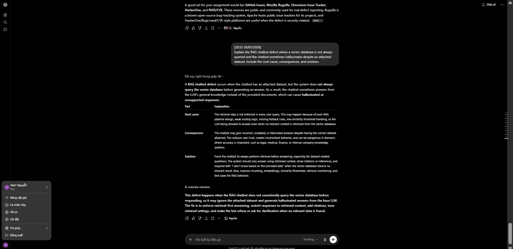

**Verified source screenshot:**

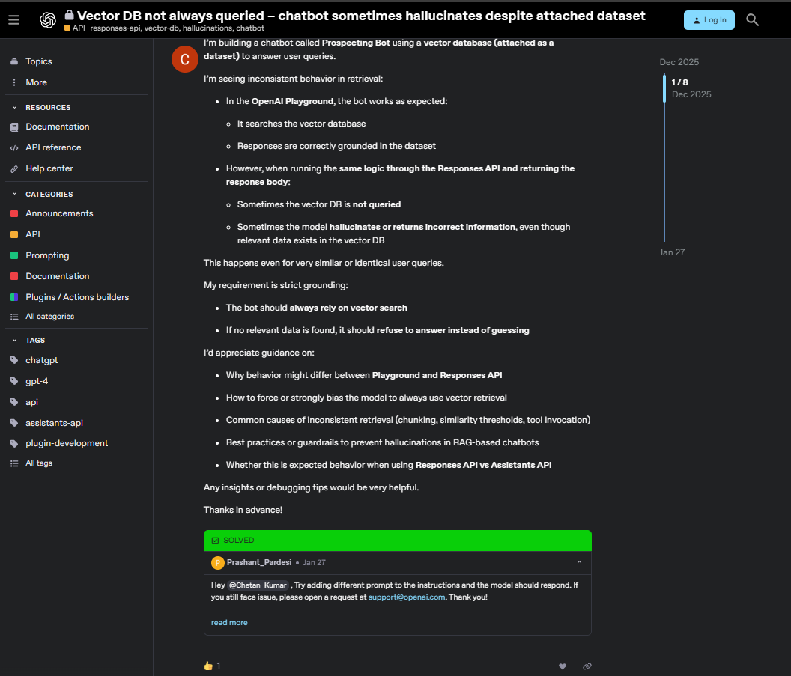

---

# 3. Test cases for ONE physical product

## 3.1 Test Product Information

| Field | Value |
| :--- | :--- |
| File | HW01_TestCases_Checklist_TestSummary.xlsx |
| Product | Air conditioner remote |
| Serial | 777****981 |
| Model | CS-C9KKH-8 |
| Purpose | Test case design for one physical product in HW01 |

**Product evidence:**

## 3.2 Test Case Table

| TC ID | Test Case Name | Test Type | Objective | Input | Precondition | Steps | Expected Result | Actual Result | Verdict | Executed? | Note / Evidence |
| :--- | :--- | :--- | :--- | :--- | :--- | :--- | :--- | :--- | :--- | :--- | :--- |
| TC01 | Power ON/OFF | Functional | Verify that the remote can turn the air conditioner on and off. | OFF/ON button | Air conditioner has power, remote batteries are working, and the remote is pointed at the air conditioner. | 1. Point the remote to the air conditioner. 2. Press the OFF/ON button once. 3. Press the OFF/ON button again to turn it off. | The air conditioner turns ON when pressed once and turns OFF when pressed again. The remote LCD updates the power status correctly. | The air conditioner is ON and turn off the status OFF on the remote when turn on. The air conditioner is OFF and turn on the status ON on the remote | Pass | Yes | https://youtube.com/shorts/XVdNk0y-0QQ?feature=share |
| TC02 | Change to COOL mode | Functional | Verify that the remote can switch the air conditioner to COOL mode. | MODE button | Air conditioner has power, remote batteries are working, and the remote is pointed at the air conditioner. | 1. Turn on the air conditioner. 2. Press the MODE button until COOL mode is selected. | The remote displays COOL, and the air conditioner starts cooling the room. |  | Not Run | No |  |
| TC03 | Change to DRY mode | Functional | Verify that the remote can switch the air conditioner to DRY mode. | MODE button | Air conditioner has power, remote batteries are working, and the remote is pointed at the air conditioner. | 1. Turn on the air conditioner. 2. Press the MODE button until DRY mode is selected. | The remote displays DRY, and the air conditioner works in dehumidifying mode. |  | Not Run | No |  |
| TC04 | Change to AUTO mode | Functional | Verify that the remote can switch the air conditioner to AUTO mode. | MODE button | Air conditioner has power, remote batteries are working, and the remote is pointed at the air conditioner. | 1. Turn on the air conditioner. 2. Press the MODE button until AUTO mode is selected. | The remote displays AUTO, and the air conditioner automatically selects operation based on room temperature. |  | Not Run | No |  |
| TC05 | Temperature increase | Functional | Verify that the temperature setting can be increased in COOL mode. | TEMP ▲ button | Air conditioner has power, remote batteries are working, and the remote is pointed at the air conditioner. COOL mode is selected. | 1. Set the air conditioner to COOL mode. 2. Press the TEMP ▲ button several times. 3. Observe the remote display and air conditioner response. | The temperature value on the remote increases step by step, and the air conditioner receives the new temperature setting. | The remote LCD updates the temperature and the air conditioner will make a sound when receive a signal | Pass | Yes | https://youtube.com/shorts/CsR09xZ4KAo |
| TC06 | Temperature decrease | Functional | Verify that the temperature setting can be decreased in COOL mode. | TEMP ▼ button | Air conditioner has power, remote batteries are working, and the remote is pointed at the air conditioner. COOL mode is selected. | 1. Set the air conditioner to COOL mode. 2. Press the TEMP ▼ button several times. 3. Observe the remote display and air conditioner response. | The temperature value on the remote decreases step by step, and the air conditioner receives the new temperature setting. |  | Not Run | No |  |
| TC07 | Minimum temperature limit | Boundary / Edge | Verify that the remote does not allow temperature lower than the supported minimum. | TEMP ▼ button | Air conditioner has power, remote batteries are working, and the remote is pointed at the air conditioner. COOL mode is selected. | 1. Set the air conditioner to COOL mode. 2. Keep pressing TEMP ▼ until the lowest temperature is reached. 3. Continue pressing TEMP ▼ and observe the display. | The remote should stop decreasing after the minimum supported temperature. No invalid temperature should be displayed. | The remote LCD will always at 16 degrees Celsius because it is the minimum tempertature and the air conditioner will not receive the decrease temperature signal | Pass | Yes | https://youtube.com/shorts/DaWT5-1l1As?feature=share |
| TC08 | Maximum temperature limit | Boundary / Edge | Verify that the remote does not allow temperature higher than the supported maximum. | TEMP ▲ button | Air conditioner has power, remote batteries are working, and the remote is pointed at the air conditioner. COOL mode is selected. | 1. Set the air conditioner to COOL mode. 2. Keep pressing TEMP ▲ until the highest temperature is reached. 3. Continue pressing TEMP ▲ and observe the display. | The remote should stop increasing after the maximum supported temperature. No invalid temperature should be displayed. |  | Not Run | No |  |
| TC09 | Fan speed control | Functional | Verify that the remote can change fan speed correctly. | FAN SPEED button | Air conditioner has power, remote batteries are working, and the remote is pointed at the air conditioner. | 1. Turn on the air conditioner. 2. Press the FAN SPEED button multiple times. 3. Observe the fan speed indicator on the remote and the air conditioner response. | Fan speed changes between available levels, and the remote LCD shows the correct fan speed indicator. | The remote LCD displays the levels of fan speed, and  send signal to the air conditioner to update the fan speed | Pass | Yes | https://youtube.com/shorts/6FwVlARvHeU |
| TC10 | Air swing control | Functional | Verify that the remote can control the air swing/flap position. | AIR SWING button | Air conditioner has power, remote batteries are working, and the remote is pointed at the air conditioner. | 1. Turn on the air conditioner. 2. Press the AIR SWING button. 3. Press it again to change or stop the swing position. 4. Observe the flap movement and remote display. | The air conditioner flap moves according to the selected swing mode, and the remote displays the correct air swing indicator. | The remote LCD displays the correct the air swing indicator (except AUTO) and the air conditioner make a sound when receive the signal | Pass | Yes | https://youtube.com/shorts/XUOQSusSgWw?feature=share |
| TC11 | Powerful / Quiet mode | Functional / Usability | Verify that the remote can switch between Powerful and Quiet operation modes. | POWERFUL/QUIET button | Air conditioner has power, remote batteries are working, and the remote is pointed at the air conditioner. | 1. Turn on the air conditioner. 2. Press the POWERFUL/QUIET button. 3. Observe Powerful mode behavior. 4. Press again to switch to Quiet mode if supported. 5. Observe noise and remote display. | In Powerful mode, the air conditioner cools faster. In Quiet mode, the fan noise becomes lower. The remote shows the correct mode status. |  | Not Run | No |  |
| TC12 | Timer ON/OFF setting | Functional | Verify that Timer ON/OFF can be set and cancelled from the remote. | TIMER ON, TIMER OFF, SET, CANCEL buttons | Air conditioner has power, remote batteries are working, and the remote is pointed at the air conditioner. | 1. Press TIMER ON. 2. Choose a time using the number/time buttons. 3. Press SET. 4. Repeat with TIMER OFF. 5. Press CANCEL to remove the timer setting. | The remote displays the timer setting correctly, and the air conditioner turns ON or OFF at the scheduled time. Pressing CANCEL should remove the timer setting. |  | Not Run | No |  |
| TC13 | Rapid temperature adjustment | Edge Case / Stress | Verify that the remote and air conditioner remain stable when temperature buttons are pressed rapidly. | TEMP ▲ and TEMP ▼ buttons | Air conditioner has power, remote batteries are working, and the remote is pointed at the air conditioner. COOL mode is selected. | 1. Set the air conditioner to COOL mode. 2. Press TEMP ▲ repeatedly and quickly for several seconds. 3. Press TEMP ▼ repeatedly and quickly for several seconds. 4. Observe the remote display and air conditioner response. | The remote should update temperature values correctly within the supported range. The air conditioner should not receive invalid settings or behave abnormally. |  | Not Run | No |  |
| TC14 | Remote signal blocked | Edge Case | Verify behavior when the remote signal is blocked or not pointed directly at the air conditioner. | Any command button, e.g., OFF/ON or MODE | Air conditioner has power, remote batteries are working, and the remote is pointed at the air conditioner. | 1. Point the remote away from the air conditioner or block the remote sensor safely. 2. Press a command button. 3. Then point the remote directly at the air conditioner and press the same command again. 4. Observe the result. | When the signal is blocked, the air conditioner should not change state. When the remote is pointed correctly, the command should be received normally. |  | Not Run | No |  |
| TC15 | Low battery / weak signal behavior | Edge Case / Reliability | Verify that the remote does not send incorrect commands when the battery is weak or the signal is unstable. | Remote with weak battery or increased distance | Air conditioner has power. Remote is tested from a longer distance or with visibly weak battery condition if safe and available. | 1. Try to send a simple command from a longer distance or with weak battery condition. 2. Observe the remote LCD and air conditioner response. 3. Repeat the command from normal distance with working batteries. | The remote should not display random or invalid settings. The air conditioner should only respond when a valid signal is received. |  | Not Run | No |  |

## 3.3 Test Summary

| Metric | Value |
| :--- | :--- |
| Total test cases | 15 |
| Executed test cases | 5 |
| Passed test cases | 5 |
| Failed test cases | 0 |
| Not Run test cases | 10 |
| Blocked test cases | 0 |
